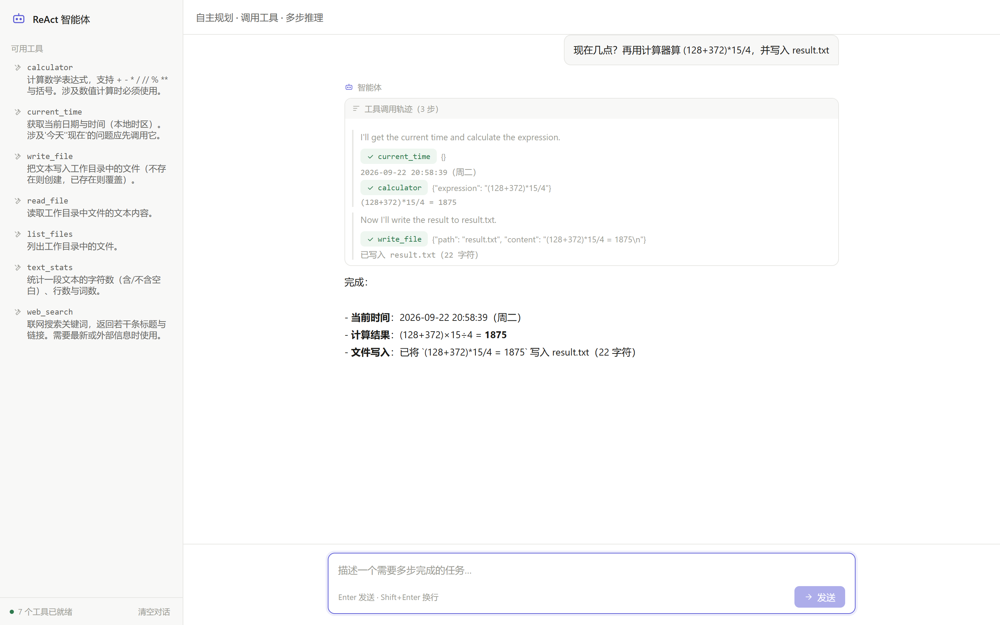

# 多工具 ReAct 智能体

> 基于 LangGraph 的 ReAct 智能体：自主规划、调用工具、根据结果继续推理，直到完成任务。

一个可本地运行的 Agent 应用：模型自行决定调用哪些工具，工具执行结果回填后再继续推理，全过程可观测。



## 功能

- ReAct 循环（`agent ⇄ tools`），支持多步推理与多工具并行调用
- 工具注册表：新增工具只需加一个类并注册，编排与接口零改动
- 工具执行错误重试、未知工具与非法参数的兜底
- 最大步数保护，避免无限循环
- 接口：同步执行返回完整轨迹；流式执行实时推送思考、工具调用与结果
- 内置单页前端，可视化展示工具调用轨迹

## 技术栈

| 层 | 选型 |
|---|---|
| 编排 | LangGraph（`StateGraph` + 条件边） |
| Web | FastAPI + Uvicorn |
| 模型 | DeepSeek（OpenAI 兼容，function calling + 流式） |
| 前端 | 原生 HTML/CSS/JS（零构建，由 FastAPI 直接挂载） |

## 内置工具

| 名称 | 说明 |
|---|---|
| `calculator` | 算术表达式求值（AST 白名单，拒绝任意代码执行） |
| `current_time` | 当前日期与时间 |
| `write_file` / `read_file` / `list_files` | 工作目录内的文件读写（防目录穿越） |
| `text_stats` | 文本字符数、行数、词数统计 |
| `web_search` | 联网搜索（DuckDuckGo HTML 端点，需要外网） |

### 新增一个工具

```python
# app/agent/tools/weather.py
from app.agent.tools.base import BaseTool

class WeatherTool(BaseTool):
    name = "weather"
    description = "查询指定城市今天的天气"
    parameters = {
        "type": "object",
        "properties": {"city": {"type": "string", "description": "城市名"}},
        "required": ["city"],
    }

    def run(self, city: str) -> str:
        return f"{city}：晴，26℃"
```

在 `app/agent/tools/__init__.py` 末尾 `register(WeatherTool())` 即可，模型下次运行就能调用它。

## 目录结构

```
react-agent-toolkit/
├── app/
│   ├── main.py              # 应用工厂：中间件 / 异常处理 / 路由与静态挂载
│   ├── config.py            # Settings（.env 读取，密钥零硬编码）
│   ├── logging_conf.py      # 日志配置
│   ├── errors.py            # 领域异常
│   ├── schemas.py           # 请求 / 响应模型
│   ├── prompts.py           # 智能体提示词
│   ├── llm.py               # LLM 接口 + DeepSeek 实现（含流式与工具调用）
│   ├── api/                 # 接口层
│   │   ├── deps.py          #   依赖装配
│   │   └── agent.py         #   /api/v1/agent/*
│   ├── services/            # 用例层
│   │   └── agent.py         #   执行与流式执行
│   ├── agent/               # 能力层
│   │   ├── tools/           #   工具注册表（base + 各工具）
│   │   ├── executor.py      #   执行器：重试与兜底
│   │   └── graph.py         #   ReAct 循环（LangGraph）
│   └── static/index.html    # 单页前端
├── docs/                    # 设计文档与架构说明
├── examples/                # 示例
├── scripts/e2e_test.py      # 端到端冒烟脚本
├── tests/                   # pytest 用例
├── Dockerfile
├── requirements.txt
└── .env.example
```

## 快速开始

```bash
python -m venv .venv
.venv\Scripts\activate          # Windows；macOS/Linux 用 source .venv/bin/activate

pip install -r requirements.txt
# 国内建议：pip install -i https://pypi.tuna.tsinghua.edu.cn/simple -r requirements.txt

copy .env.example .env          # 编辑并填入 DEEPSEEK_API_KEY
uvicorn app.main:app --reload --port 8000
```

打开 http://localhost:8000 使用；接口文档见 http://localhost:8000/docs 。

## 配置项（.env）

| 变量 | 默认 | 说明 |
|---|---|---|
| `DEEPSEEK_API_KEY` | — | 必填 |
| `MAX_STEPS` | `6` | ReAct 最大工具轮次 |
| `TOOL_RETRIES` | `2` | 单个工具失败后的重试次数 |
| `TOOL_TIMEOUT` | `10` | 工具请求超时（秒） |
| `WORKSPACE_DIR` | `./data/workspace` | 文件工具的工作目录 |
| `LLM_TEMPERATURE` | `0.2` | 生成温度 |
| `LOG_LEVEL` | `INFO` | 日志级别 |

## API

| 方法 | 路径 | 说明 |
|---|---|---|
| GET | `/health` | 存活检查（含已注册工具） |
| GET | `/ready` | 就绪检查（模型已配置、工具已注册） |
| GET | `/api/v1/agent/tools` | 已注册工具列表 |
| POST | `/api/v1/agent/run` | 同步执行，返回答案与工具调用轨迹 |
| POST | `/api/v1/agent/stream` | 流式执行（SSE） |

流式事件类型：`step`（进入新一轮）、`token`（思考增量）、`tool_call`、`tool_result`、`final`、`error`。

## 测试

```bash
pytest -q                       # 单元测试（离线，使用脚本化假 LLM）
uvicorn app.main:app --port 8000
AGENT_BASE_URL=http://127.0.0.1:8000 python scripts/e2e_test.py
```

## 部署

```bash
docker build -t react-agent .
docker run -p 8000:8000 -e DEEPSEEK_API_KEY=sk-xxx react-agent
```

`/health` 可接健康检查探针（镜像已内置 `HEALTHCHECK`）；密钥通过运行时环境变量注入。

## 常见问题

| 现象 | 原因与解决 |
|---|---|
| 启动报端口被占用 | 换端口：`--port 8010` |
| `web_search` 返回错误 | 该工具需要外网；内网环境可换用其它搜索服务 |
| agent 反复调用工具直到上限 | 调大 `MAX_STEPS`，或在提示词中约束工具使用条件 |
| `pip install` 慢 | 使用清华镜像 |

## Roadmap

- 工具参数校验下沉到 schema，返回更精确的错误提示
- 支持并行工具调用与超时取消
- 接入真实搜索 API（Tavily / Serper）作为可选后端
- 会话历史持久化，支持多轮任务延续
